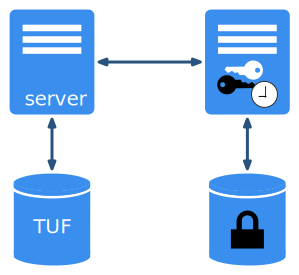

<!--[metadata]>
+++
title = "Notary Service Architecture"
description = "How the three requisite notary components interact"
keywords = ["docker, notary, notary-client, docker content trust, content trust, notary-server, notary server, notary-signer, notary signer, notary architecture"]
[menu.main]
parent="mn_notary"
weight=3
+++
<![end-metadata]-->

# Contents 

- [Overview of Notary Service](#overview)
- [Example of a successful Client-Server-Signer interaction](#information-flow)
- [Threat model](#threat-model)

This document assumes a prior understanding of
[The Update Framework](https://theupdateframework.github.io/).

# Overview of Notary Service 

A Notary service consists of a Notary Server, which stores and updates the signed
[TUF metadata files](
https://github.com/theupdateframework/tuf/blob/develop/docs/tuf-spec.txt#L348)
for multiple repositories in an associated database, and a Notary Signer, which
stores private keys for and signs metadata for the Notary Server.

Root, targets, and (sometimes) snapshot metadata are generated and signed by
clients, who upload the metadata to the Notary Server.  The Server is
responsible for:

- ensuring that any uploaded metadata is valid, signed, and self-consistent
- generating the timestamp (and sometimes snapshot) metadata
- storing and serving to clients the latest valid metadata for any repository

The Notary Signer is responsible for:

- storing the private signing keys
[wrapped](
https://tools.ietf.org/html/draft-ietf-jose-json-web-algorithms-31#section-4.4)
and [encrypted](
https://tools.ietf.org/html/draft-ietf-jose-json-web-algorithms-31#section-4.8)
using [Javascript Object Signing and Encryption](
https://github.com/dvsekhvalnov/jose2go) in a database separate from the
Notary Server database
- performing signing operations with these keys whenever the Notary Server requests

[[back to top](#top)]

# Example Client-Server-Signer interaction 

1. Notary Server optionally supports authentication from clients using
   [JWT](http://jwt.io/) tokens.  This requires an authorization server that
   manages access controls, and a cert bundle from this authorization server
   containing the public key it uses to sign tokens.

   If token authentication is enabled on Notary Server, then any connecting
   client that does not have a token will be redirected to the authorization
   server.

   Please see the docs for [Docker Registry v2 authentication](
   https://github.com/docker/distribution/blob/master/docs/spec/auth/token.md)
   for more information.

2. The client will log in to the authorization server via basic auth over HTTPS,
   obtain a bearer token, and then present the token to Notary Server on future
   requests.

3. When clients uploads new metadata files, Notary Server checks them against
   any previous versions for conflicts, and verifies the signatures, checksums,
   and validity of the uploaded metadata.

4. Once all the uploaded metadata has been validated, Notary Server
   generates the timestamp (and maybe snapshot) metadata.  It sends this
   generated metadata to the Notary Signer to be signed.

5. Notary Signer gets the requisite encrypted private keys from its database if
   it has them, decrypts the keys, and uses them to sign the metadata.  If
   successful, it sends the signatures back to Notary Server.

6. Notary Server stores all the signed metadata, both client-uploaded and
   server-generated metadata, in the TUF database. The generated timestamp and
   snapshot metadata certify that the metadata files the client uploaded are the
   most recent for that repository.

   Finally, Notary Server will notify the client that their upload was successful.

7. The client can now immediately download the latest metadata from the server,
   using the still-valid bearer token to connect.  Notary Server only needs to
   obtain the metadata from the database, since none of the metadata is expired
   yet.

   If the timestamp were expired, for example, Notary Server would go through
   the entire sequence where it generates a new timestamp, request Notary Signer
   for a signature, stores the newly signed timestamp in the database.  It then
   sends this new timestamp, along with the rest of the stored metadata, to the
   requesting client.

[[back to top](#top)]

# Threat model 

- **Notary Server compromise**

	In the event of a Notary Server compromise, an attacker would have access to
	the metadata stored in the database as well as access to Notary Signer to
   sign anything with any key the Signer holds.

	- **Denial of Service** - An attacker could reject client requests and corrupt
   	or delete metadata from the database, thus preventing clients from being
      able to download or upload metadata.

	- **Malicious Content** - An attacker can create, store, and serve arbitrary
      metadata content for one or more repositories.  However, they do not have
      access to the original root, target, or (maybe) snapshots keys for
      existing repositories.

      Only clients who have never seen, and do not have any form of pinned trust
      for, the compromised repositories can be tricked into downloading and
      trusting the malicious content for these repositories.

      Clients who have pinned trust for the compromised repositories, either
      due to configuration or due to TOFU (trust on first use), will immediately
      detect that the content is malicious and would not trust any root, targets,
      or (maybe) snapshot metadata for these repositories.

   - **Rollback, Mix and Match** - The attacker can request that
      the Notary Signer sign whatever timestamp (and maybe snapshot) metadata
      they want.  They can create valid timestamp and snapshot metadata that
      certifies that the latest version of the repository contains
      strictly older, or even a mix of older and newer, data.

      Clients both with and without pinned trust would be vulnerable to these
      attacks.

   Note that the timestamp and snapshot keys are never compromised; once the
   Server compromise is mitigated, an attacker will not be able to generate
   valid timestamp or snapshot metadata and serve them on a malicious mirror, for
   example.

- **Notary Signer compromise**

   In the event of a Notary Signer compromise, an attacker would have access to
   all the private keys stored in a database.  If the keys are stored in an HSM,
   they would have the ability to interfere with the keys in the HSM, but not
   to exfiltrate the private keys.

   - **Denial of Service** - An attacker could reject all Notary Server requests
      and corrupt or delete keys from the database (or even delete keys from an
      HSM), and thus prevent Notary Servers from being able to sign generated
      timestamps or snapshots.

   - **Key Compromise** - If the Notary Signer uses a database as its backend,
      an attacker can exfiltrate all the private keys.  This will let them set
      up a malicious mirror to perform rollback and mix and match attacks,
      for instance.

[[back to top](#top)]
